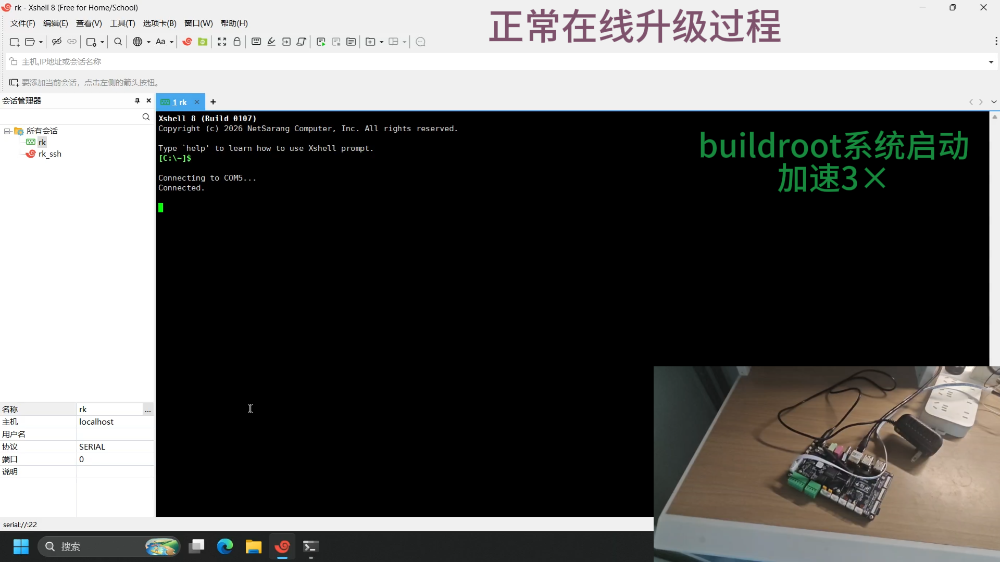
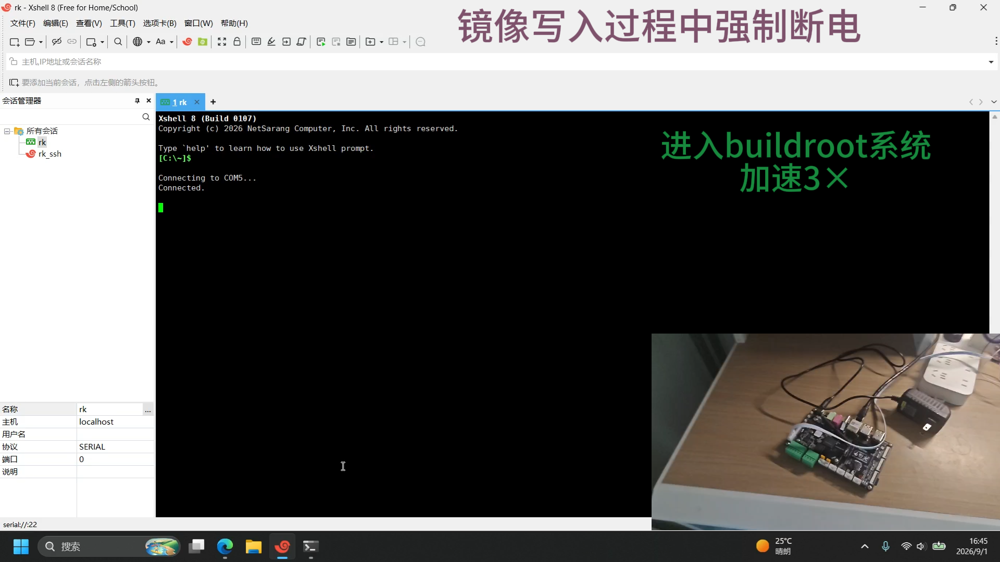
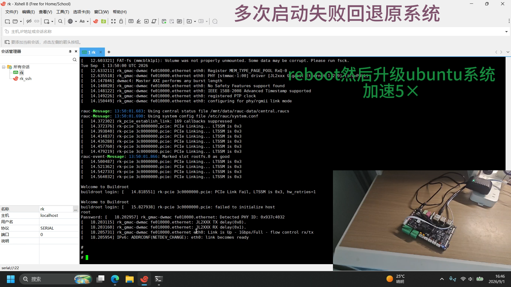
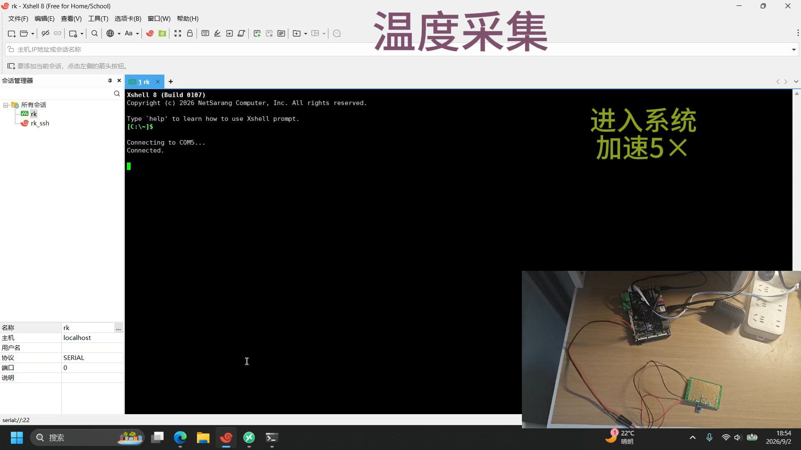
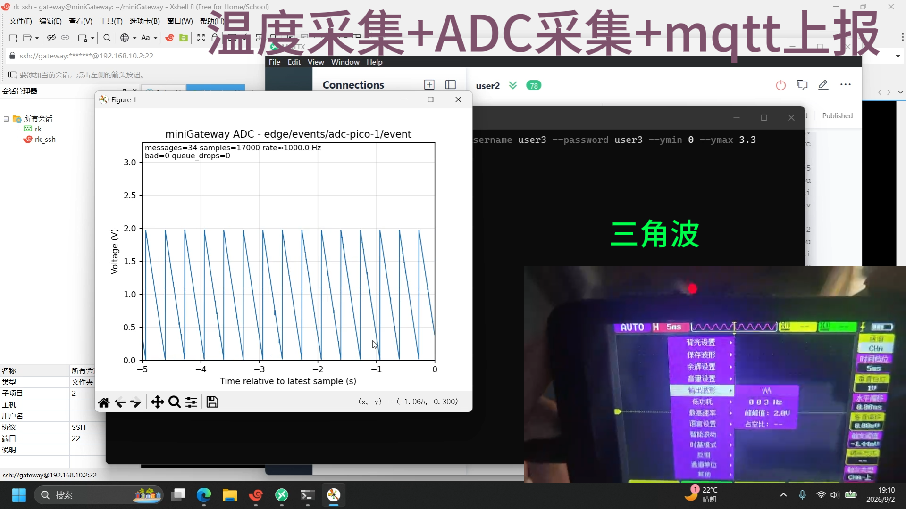

# rkGateway
多协议接入框架源码：https://github.com/LRs0ng/miniGateway.git
## 1. 核心功能演示
### OTA升级
特点：
- 多次启动失败自动回退
- 断电防变砖
#### 正常OTA升级过程
[](https://github.com/user-attachments/assets/bfbf4a4b-a0ff-4474-a4d5-6a27be2e48a2)
#### 在镜像写入过程中断电（防变砖）
[](https://github.com/user-attachments/assets/3c2c0bfe-f0c9-4015-bd36-164b259025a2)
#### 多次启动失败回退原系统
[](https://github.com/user-attachments/assets/189d7e62-c5de-434b-aa2d-a0a6c1bb6d5b)
### 多协议接入
特点：
- 任何符合接口定义的插件都能接入系统
- 可扩展性强
- 轻量
#### 温度采集+mqtt上报
[](https://github.com/user-attachments/assets/b71753f6-4bb0-465f-9368-12bd3c498753)
#### 温度采集+ADC电压采集+mqtt上报
[](https://github.com/user-attachments/assets/da838a71-377c-43ea-8b61-3e69e228e0d0)
## 2. RK3566 摄像头 YOLOv5 NPU 链路

工程包含 `plugins/yolo` processor plugin，使用 RKNN Runtime 在 RK3566 NPU 上执行
`plugins/yolo/model/yolov5s_rk3566.rknn`。推荐的数据链路为：

```text
/dev/video0 -> camera(control, 640x640 RGB24) -> yolov5_rknn -> screen publisher
```

camera 的 `initial_capture: true` 会在受控模式的视频流拿到首个有效帧后发布一次事件；
YOLO 处理完成后通过 `ProcessingContext::submit_control()` 向 `camera-1` 发送
`capture` 控制请求，camera 取得下一帧并发布，从而形成连续的“拍摄—推理—显示”循环。

RKNN Runtime/API 位于：

```text
third_party/rknpu2/runtime/RK356X/Linux/librknn_api
```

交叉编译示例：

```bash
cmake -S . -B build \
  -DCMAKE_C_COMPILER=aarch64-linux-gnu-gcc \
  -DCMAKE_CXX_COMPILER=aarch64-linux-gnu-g++ \
  -DKERNEL_HEADERS="$PWD/temp/linux-headers-6.1.99-rk356x" \
  -DGATEWAY_CONFIG="$PWD/configs/yolo_linux.json" \
  -DCMAKE_BUILD_TYPE=Release
cmake --build build -j"$(nproc)"
```

部署 `build/miniGateway/` 到开发板时至少需要保留：

- `miniGateway`；
- `libgateway_camera.so`、`libgateway_yolo.so`、`libgateway_screen.so`；
- `librga.so*`、`librknnrt.so`；
- `model/yolov5s_rk3566.rknn`；
- `config.json`（由 `configs/yolo_linux.json` 生成）。

在主机上只能进行 ARM64 交叉编译和静态检查，不能直接运行该插件；推理运行必须在
带有 RK3566 NPU、V4L2 摄像头和 framebuffer 的开发板上进行。
